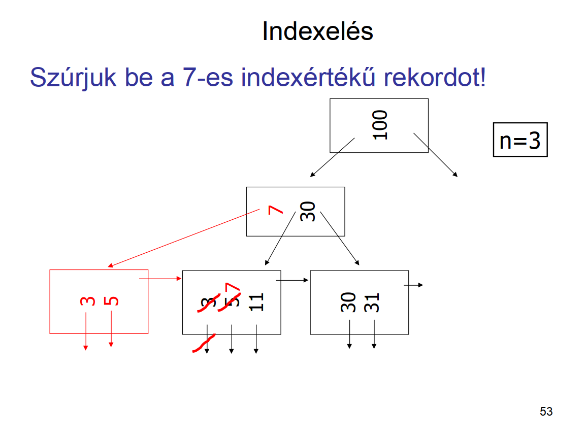
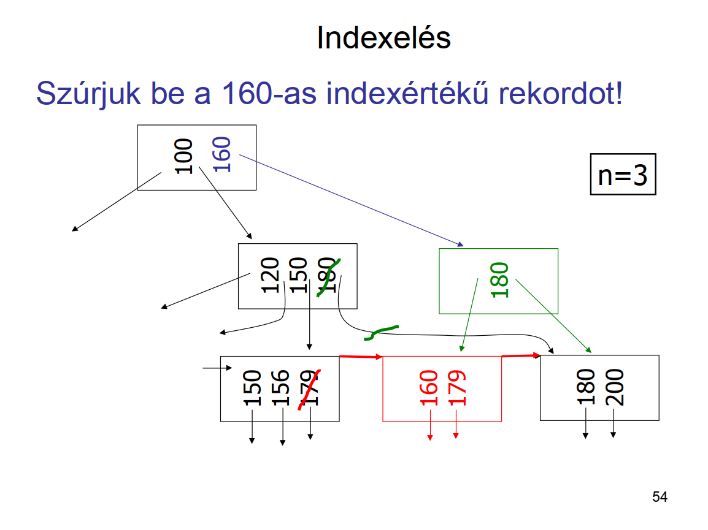
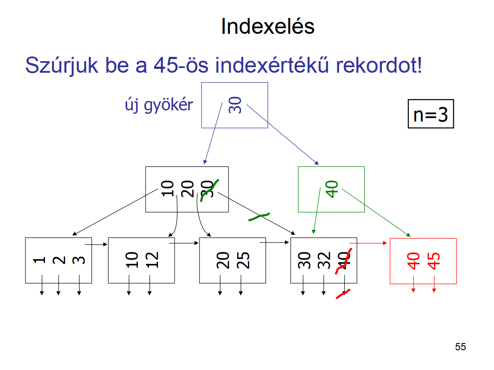
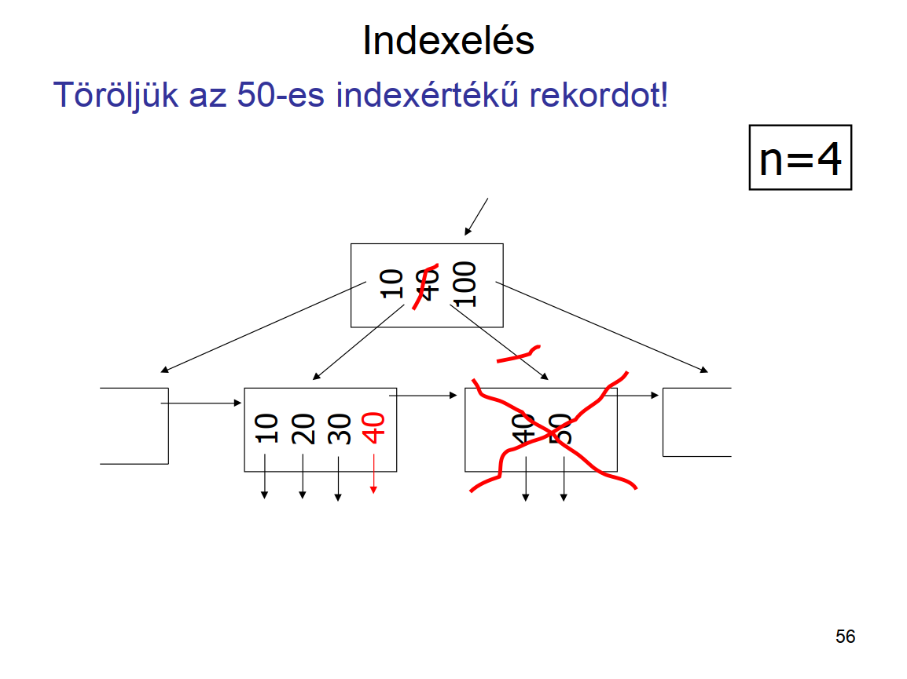
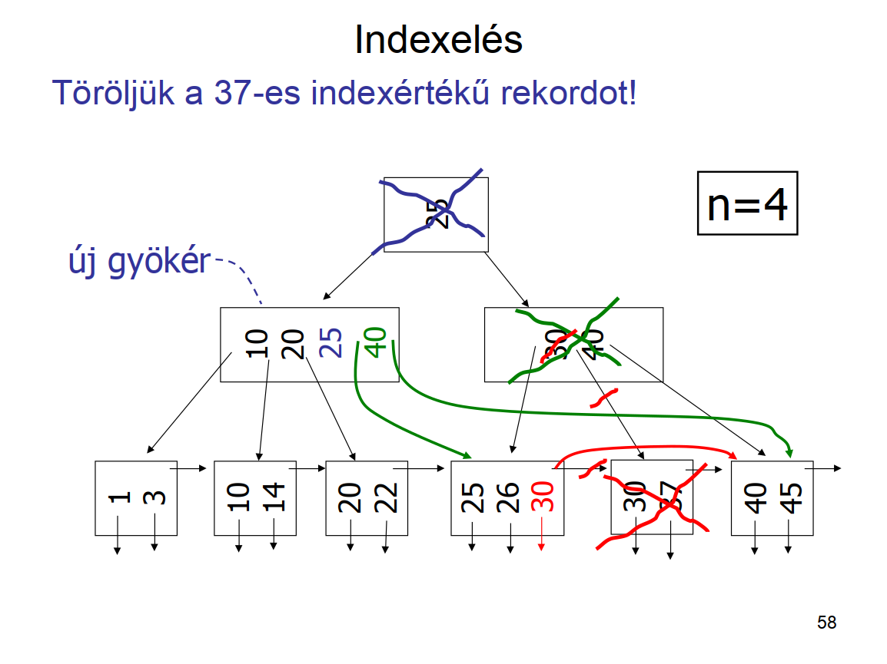
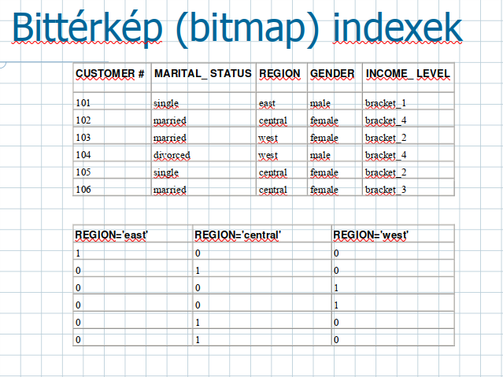
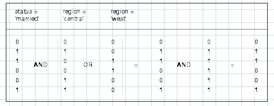
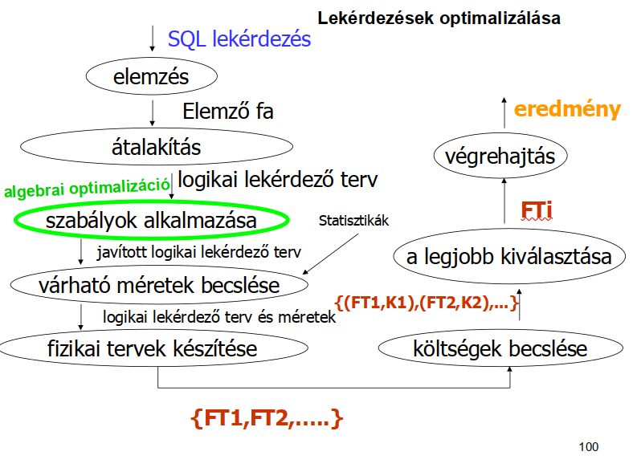
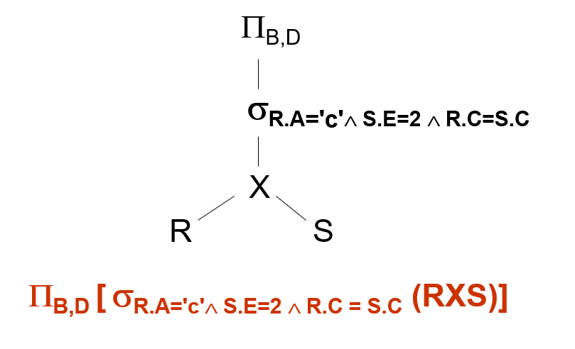
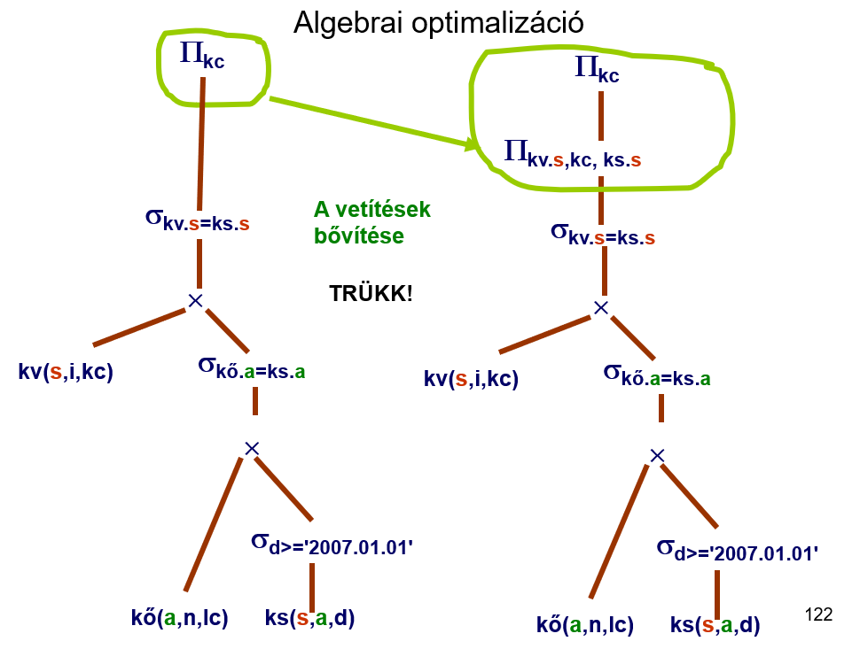

# Adatbázisok II. vizsga kérdések és válaszok

## 1. Mit hívunk statikus, és mit dinamikus adatbázisnak? (1 pont) 

- Statikus adatbázis:
  - Ritkán módosul
  - A lekérdezések gyorsasága a fontosabb
- Dinamikus adatbázis:
  - Gyakran módosul
  - Ritkán végzünk lekérdezést

## 2. Fogalmazzunk meg 3 célt, amire az indexelés kiválasztásánál figyelni kell! (3 pont)

- Keresési idő
- Tárméret
- Módosítási idő
- Pl.: indexek használatával csökken a keresési idő, nő a tárméret, és nő a
  módosítási idő

## 3. Mit tételezünk fel, mivel arányos a beolvasás, kiírás költsége? (1 pont)

- Feltételezzük, hogy a beolvasás, kiírás költsége arányos a háttértároló és
  memória között mozgatott blokkok számával.

## 4. Adjuk meg az alábbi paraméterek jelentését! l, b, B, T, bf, M, I(A) (7 pont)

- `l` (_length_): rekordméret (bájtokban)
- `b`: blokkméret (bájtokban)
- `T` (_tuple_): rekordok száma 
- `B`: a fájl mérete blokkokban
- `bf`: blokkolási faktor
  - (mennyi rekord fér el egy blokkban: `bf = b/l alsó egészrésze`)
- `B = T/bf felső egészrésze`
- `M`: memória mérete blokkokban
- `I(A)`: képméret, az A oszlopban szereplő különböző értékek száma
  - `I(A) = | PI_A (R) |`

## 5. Adjuk meg RxS méretét blokkokban kifejezve! (2 pont)

```text
B(RxS) = (T(R) * T(S)) * (l(R) + l(S)) / b =
       = (T(S) * T(R) * l(R)/b) + (T(R) * T(S) * l(S)/b) =
       = T(S) * B(R) + T(R) * B(S)
```

## 6. Mit jelent az egyenletességi feltétel? (1 pont)

- Fel szoktuk tenni, hogy az `A = a` feltételnek eleget tevő rekordokból
  nagyjából egyforma számú rekord szerepel.

## 7. Mekkora adategységet olvas az író-olvasó fej? (1 pont)

- Az író-olvasó fej nagyobb adategységeket (blokkokat) olvas be.

## 8. Mitől függhet a blokkméret? (1 pont)

- A blokkméret maga fix
- Adatbázis-kezelőtől, operációs rendszertől, hardvertől függ.
- Oracle esetén 8K az alapértelmezés.

## 9. Egyenletességi feltétel esetén hány blokkból áll a sA=a(R) lekérdezés eredménye? (1 pont)

- `B(Sigma_A = a(R)) = B(R) / I(A)`

## 10. Soroljunk fel legalább 7 különböző fájlszervezési módszert? (7 pont)

- Kupac (heap),
- Hasító index (hash),
- Rendezett állomány,
- Elsődleges index (ritka index),
- Másodlagos index (sűrű index),
- Többszintű index,
- B+-fa, B*-fa,

## 11. Kupac szervezés esetén mennyi a keresés költsége legrosszabb esetben? (1 pont)

- `A = a` keresési idő legrosszabb esetben `B`.

## 12. Kupac szervezés esetén mennyi a beszúrás költsége? (1 pont)

- Utolsó blokkba tesszük a rekordot, 1 olvasás + 1 írás
- Módosítás: 1 keresés + 1 írás
- Törlés: 1 keresés + 1 írás (üres hely marad, vagy a törlési bitet állítják át)
- Itt a keresés költsége `B` a legrosszabb esetben
  - `B/2` átlagos esetben az egyenletességi feltétel mellett

## 13. Mit mond meg a h(x) hasító függvény értéke? (1 pont)

- Egy `h(x) eleme {1, …, K}` hasító függvény értéke mondja meg, hogy melyik kosárba
  tartozik a rekord, ha `x` volt az indexmező értéke a rekordban

## 14. Mikor jó egy hasító függvény és ilyenkor milyen hosszúak a blokkláncok? (2 pont)

- Akkor jó egy hasító függvény, ha nagyjából egyforma hosszú blokkláncok
  keletkeznek, azaz egyenletesen sorolja be a rekordokat.

## 15. Mennyi az sA=a(R) lekérdezés keresési költsége jó hasító index esetén? (1 pont)

- Ha elég a `h(a)` sorszámú kosarat végignézni, amely `B/K` blokkból álló kupacnak
  felel meg, akkor legrosszabb esetben `B/K` a lekérdezés keresési költsége.

## 16. Ha túl nagynak választjuk a K-t hasításkor, akkor ez milyen problémát okozhat? (1 pont)

- Nagy K esetén sok olyan blokklánc lehet, amely egy blokkból fog állni, és a
  blokkban is csak 1 rekord lesz. Ekkor a keresési idő: 1 blokkbeolvasás, de B
  helyett T számú blokkban tároljuk az adatokat.

## 17. Milyen keresésre nem jó a hasító indexelés? (1 pont)

- Intervallumos típusú (`a < A < b`) keresésre nem jó.

## 18. Mit jelent a dinamikus hasító indexelés és milyen két fajtáját ismerjük? (3 pont)

- Előre nem rögzítjük a kosarak számát.
- A kosarak száma beszúráskor, törléskor változhat.
- Fajtái:
  - Kiterjeszthető hasító index
  - Lineáris hasító index:

## 19. Kiterjeszthető hasítás esetén a h(K) érték alapján melyik kosárba kerül a rekord? (2 pont)

- A `h(K)` `k` hosszú kódnak vegyük az `i` hosszú elejét, és azt kosarat, amelynek
  kódja a `h(K)` kezdő szelete. Ha van hely a kosárban, tegyük bele a rekordot,
  ha nincs, akkor nyissunk egy új kosarat, és a következő bit alapján osszuk
  ketté a telített kosár rekordjait. Ha ez a bit mindegyikre megegyezik, akkor
  a következő bitet vesszük a szétosztáshoz, és így tovább.

## 20. Milyen probléma keletkezhet kiterjeszthető hasító index esetén és mi rá a megoldás? (2 pont)

-  Probléma:
- Ha az új sorok hasító értékének eleje sok bitben megegyezik, akkor hosszú
  ágak keletkezhetnek (nincs kiegyensúlyozva a fa).
- Megoldás:
  - A bináris gráfot teljessé is tehetjük. A gráfot egy tömbbel ábrázolhatjuk.
    Ekkor minden kosár azonos szinten lesz, de közös blokkjai is lehetnek a
    kosaraknak. Túlcsordulás esetén a kosarak száma duplázódik.
  - Ábráért ld. http://people.inf.elte.hu/kiss/13ab2osz/fizika.ppt 14. dia

## 21. Lineáris hasító index esetén mikor nyitunk meg új kosarat? (1 pont)

- Új kosarat akkor nyitunk meg, ha egy előre megadott értéket elér a kosarakra
  jutó átlagos rekordszám.
- `(rekordok száma/kosarak száma > küszöb)`

## 22. Lineáris hasító index esetén a h(K) érték alapján melyik kosárba kerül a rekord? (2 pont)

- Ha `n` kosarunk van, akkor a hasító függvény értékének utolsó `log(n)` bitjével
  megegyező sorszámú kosárba tesszük, ha van benn hely. Ha nincs, akkor
  hozzáláncolunk egy új blokkot és abba tesszük.
- Ha nincs megfelelő sorszámú kosár, akkor abba a sorszámú kosárba tesszük,
  amely csak az első bitjében különbözik a keresett sorszámtól.

## 23. Rendezett állomány esetén adjuk meg a bináris (logaritmikus) keresés lépéseit! (4 pont)

- Ha a rendező mező és kereső mező egybeesik, akkor bináris (logaritmikus)
  keresést lehet alkalmazni:
  - Beolvassuk a középső blokkot,
  - Ha nincs benne az `A = a` értékű rekord, akkor eldöntjük, hogy a blokklánc
    második felében, vagy az első felében szerepelhet-e egyáltalán,
  - Beolvassuk a felezett blokklánc középső blokkját,
  - Addig folytatjuk, amíg megtaláljuk a rekordot, vagy a vizsgálandó maradék
    blokklánc már csak 1 blokkból áll

## 24. Mennyi a keresési költség rendezett mező esetében? (1 pont)

- `log_2(B)` (kettes alapú logaritmus `B`)

## 25. Mennyi a keresési költség rendezett mező esetében, ha gyűjtő blokkokat is használunk? (1 pont)

- Összköltség `log_2(B - G) + G` (Ha a gyűjtö blokkban találjuk meg)
  - Egyébként: `log_2(B - G)`
- Részletesebb leírás: http://people.inf.elte.hu/kiss/13ab2osz/fizika.ppt 22. dia alja

## 26. Mennyi a keresési költség rendezett mező esetében, ha minden blokkot félig üresen hagyunk? (1 pont)

- `1 + log_2(B)`

## 27. Milyen mindig az indexrekord szerkezete? (1 pont)

- `(a, p)`, ahol `a` egy érték az indexelt oszlopban, `p` egy blokkmutató, arra
  a blokkra mutat, amelyben az `A = a` értékű rekordot tároljuk.
- Az index mindig rendezett az indexértékek szerint.

## 28. Adjuk meg az elsődleges index 5 jellemzőjét! (5 pont)

- Főfájl is rendezett
- Csak 1 elsődleges indexet lehet megadni (mert csak egyik mező szerint lehet
  rendezett a főfájl.
- Elég a főfájl minden blokkjának legkisebb rekordjához készíteni indexrekordot
- Indexrekordok száma: `T(I) = B` (ritka index)
- Indexrekordból sokkal több fér egy blokkba, mint a főfájl rekordjaiból:
  `bf(I) >> bf`, azaz az indexfájl sokkal kisebb rendezett fájl, mint a főfájl: 
- `B(I) = B / bf(I) << B = T / bf`

## 29. Mit hívunk fedőértéknek? (1 pont)

- A legnagyobb olyan indexérték, amely a keresett értéknél kisebb vagy egyenlő.

## 30. Mennyi a keresési költség elsődleges index esetén? (1 pont)

- `1 + log_2(B(I))`

## 31. Adjuk meg a másodlagos index 5 jellemzőjét! (5 pont)

- Főfájl rendezetlen (az indexfájl mindig rendezett)
- Több másodlagos indexet is meg lehet adni 
- A főfájl minden rekordjához kell készíteni indexrekordot
- Indexrekordok száma: `T(I) = T` (sűrű index)
- Indexrekordból sokkal több fér egy blokkba, mint a főfájl rekordjaiból:
  `bf(I) >> bf`, azaz az indexfájl sokkal kisebb rendezett fájl, mint a főfájl:
- `B(I) = T / bf(I) << B = T/bf`

## 32. Hogyan keresünk a másodlagos indexben és mennyi a keresés költsége? (5 pont)

- Az indexben keresés az index rendezettsége miatt bináris kereséssel történik:
  `log_2(B(I))`
- A talált indexrekordban szereplő blokkmutatónak megfelelő blokkot még be kell
  olvasni
- `1 + log_2(B(I)) << log_2(B)` (rendezett eset)  
- Az elsődleges indexnél rosszabb a keresési idő, mert több az indexrekord

## 33. Mit hívunk klaszterszervezésű táblának? (1 pont)

- Klaszter: nyaláb, fürt
- Klaszterszervezés egy tábla esetén egy A oszlopra: 
  - Az azonos A-értékű sorok fizikailag egymás utáni blokkokban helyezkednek el.
  - CÉL: az első találat után az összes találatot megkapjuk soros beolvasással

## 34. Mit hívunk klaszterindexnek? (1 pont)

- Klaszterszervezésű fájl esetén index az A oszlopra.

## 35. Mikor mondjuk, hogy 2 tábla klaszterszervezésű? (1 pont)

- Klaszterszervezés két tábla esetén az összes közös oszlopra:
  - A közös oszlopokon egyező sorok egy blokkban, vagy fizikailag egymás utáni
    blokkokban helyezkednek el.
  - CÉL: összekapcsolás esetén az összetartozó sorokat soros beolvasással
    megkaphatjuk.

## 36. Ha t szintű indexet használunk, mennyi a keresési költség blokkműveletek számában mérve? (1 pont)

- `log_2(B( I^(t) )) + t` db. blokkolvasás
- Mi `t`? → ld. következő kérdés

## 37. Ha t szintű indexet használunk, a legfelső szinten milyen keresést használunk? (1 pont)

- `t`: t-edik szinten `(I^t)` bináris kereéssel keressük meg a fedő indexrekordot.

## 38. Ha t szintű indexet használunk és a legfelső szint 1 blokkból áll, akkor mennyi a keresési költség? (1 pont)

- Ha a legfelső szint 1 blokkból áll, akkor `t + 1` blokkolvasást jelent.

## 39. Ha t szintű indexet használunk, mennyi az indexszintek blokkolási faktora és miért? (2 pont)

- Minden szint blokkolási faktora megegyezik, mert egyforma hosszúak az
  indexrekordok.

## 40. Ha t szintű indexet használunk, vezessük le, hogy hány blokkból áll a legfelső szint! (12 pont)

- Főfájl: `B`
  - I. szint: `B / bf(I)`
  - II. szint: `B / bf(I)^2`
  - …
  - t. szint: `B / bf(I)^t`
- ld. bővebben http://people.inf.elte.hu/kiss/13ab2osz/fizika.ppt 48. oldal
  (táblázat)

## 41. Ha t szintű indexet használunk, és a legfelső szint 1 blokkból áll, abból milyen egyenlet következik és mi a megoldása t-re? (2 pont)

- Ha `t`-edik szinten 1 blokk: `1 = B / bf(I)`
- Azaz `t = log_{bf(I)}(B) < log_2(B)`

## 42. Mi a két legfontosabb jellemzője a B+-faindexnek? (2 pont)

- Minden blokk legalább 50%-ban telített
- A szerkezeten kívül a telítettséget biztosító karbantartó algoritmusokat is
  beleértjük

## 43. Egy példa alapján szemléltessük a köztes csúcs jellemzőit B+-fa index esetén! (8 pont)

- Köztes (nem-levél) csúcs szerkezete:

```text
     ┌───────────────────────────┐  
     │                           │  
     │                           │  
  ┌╶╶╶╶ 57╶╶╶╶┐    81╶╶╶┐    95╶╶╶╶┐
  ╎  │        ╎         ╎        │ ╎  
  ╎  │        ╎         ╎        │ ╎  
  ╎  └────────╎─────────╎────────┘ ╎  n+1 mutató
  ↓           ↓         ╎          ╎  n indexérték
k < 57   57 ≤ k < 81    ╎          ╎  
                        ╎          ╎  
                        ↓          ╎  
                   81 ≤ k < 95     ╎  
                                   ╎  
                                   ↓  
                                95 ≤ k  
```

- Ahol `k` a mutató által meghatározott részben (részgráfban) szereplő
  tetszőleges indexérték

## 44. Egy példa alapján szemléltessük a levél csúcs jellemzőit B+-fa index esetén! (5 pont)

- Levél csúcs szerkezete:

```text
             ┌╶╶╶╶╶╶Köztes csúcs               
             ╎                                 
             ↓                                 
 ┌───────────────────────────┐     A sorrendben
 │                         ╶╶╶╶╶╶→ következő   
 │                           │     levél       
 │  57         81        95  │                 
 │  ╎          ╎         ╎   │                 
 │  ╎          ╎         ╎   │                 
 └──╎──────────╎─────────╎───┘                 
    ╎          ╎         ╎                     
    ↓          ↓         ↓                     
 57 index-  81 index- 95 index-                
 értékű     értékű    értékű                   
 rekord     rekord    rekord                   

```

## 45. Mutassunk példát, mikor beszúráskor egy levélcsúcsot kettéosztunk B+-fa index esetén! (5 pont)




- Mit szúrunk be és a beszúrás előtti, majd utáni két fát kell lerajzolni

## 46. Mutassunk példát, mikor beszúráskor egy köztes csúcsot kettéosztunk B+-fa index esetén! (5 pont)



- Mit szúrunk be és a beszúrás előtti, majd utáni két fát kell lerajzolni

## 47. Mutassunk példát, mikor beszúráskor nő a B+-fa index magassága! (5 pont)



- Mit szúrunk be és a beszúrás előtti, majd utáni két fát kell lerajzolni

## 48. Mutassunk példát, mikor törléskor megszüntetünk egy levélcsúcsot B+-fa index esetén! (5 pont)



- Mit törlünk és a törlés előtti, majd utáni két fát kell lerajzolni

## 49. Mutassunk példát, mikor törléskor csökken a B+-fa index magassága! (5 pont)



- Mit törlünk és a törlés előtti, majd utáni két fát kell lerajzolni

## 50. Mutassunk példát arra, mikor egy kevés elemszámú oszlopra bitmap indexet készítünk! (2 pont)



## 51. Mutassunk példát arra, mikor logikai feltételek kiértékelését bitmap vektorműveletekre vezetjük vissza! (7 pont)

```sql
SELECT COUNT(*)
FROM CUSTOMER
WHERE MARITAL_STATUS = 'married' AND
  REGION IN ('central', 'west');
```



## 52. Mi a lekérdezések optimalizálásának a célja és miket használunk fel ehhez? (5 pont)

- CÉL: A lekérdezéseket gyorsabbá akarjuk tenni a táblákra vonatkozó
  paraméterek, statisztikák, indexek ismeretében és általános érvényű
  tulajdonságok, heurisztikák segítségével

## 53. Adjuk meg a lekérdezések optimalizálásának folyamatábráját! (19 pont)



## 54. Adjuk meg egy egyszerű relációs algebrai kifejezést és gráfos ábrázolását! (4 pont)



## 55. Milyen költségmodellt használunk relációs algebrai optimalizálás esetében? (2 pont)

- A kiszámítás költsége arányos a relációs algebrai kifejezés
  részkifejezéseinek megfelelő relációk tárolási méreteinek összegével

## 56. Mi a módszer lényege relációs algebrai optimalizálás esetében? (3 pont)

- A műveleti tulajdonságokon alapuló ekvivalens átalakításokat alkalmazunk,
  hogy várhatóan kisebb méretű relációk keletkezzenek

## 57. Miért mondjuk, hogy az eljárás heurisztikus relációs algebrai optimalizálás esetén? (2 pont)

- Azért, mert nem az argumentum relációk valódi méretével számol

## 58. Miért nem egyértelmű az eredmény relációs algebrai optimalizálás esetén? (4 pont)

- Az átalakítások sorrendje nem determinisztikus, így más sorrendben
  végrehajtva az átalakításokat más végeredményt kaphatunk, de mindegyik
  általában jobb költségű, mint amiből kiindultunk

## 59. A relációs algebrai kifejezésfában melyek az unáris csúcsok? (3 pont)

- &sigma;: kiválasztás
- &Pi;: vetítés
- &rho;: átnevezés

## 60. A relációs algebrai kifejezésfában melyek a bináris csúcsok? (3 pont)

- -: kivonás
- &cup;: unió
- x: szorzás

## 61. A relációs algebrai kifejezésfában mik a levélcsúcsok? (2 pont)

- Konstans relációk vagy relációs változók

## 62. Mit hívunk ekvivalens relációs algebrai kifejezéseknek? (3 pont)

- E1(r1,...,rk) és E2(r1,...,rk) relációs algebrai kifejezések ekvivalensek (E1
  ~= E2), ha tetszőleges r1,...,rk relációkat véve E1(r1,...,rk) ~=
  E2(r1,...,rk)

## 63. Hány szabálycsoportot adunk meg relációs algebrai optimalizáláskor és mi jellemző ezekre? (4 pont)

- 11 szabálycsoport
  - kifejezések ekvivalenciáját megfogalmazó állítások
  - bizonyításuk könnyen végiggondolható
  - az állítások egy részében a kifejezések szintaktikus helyessége egyben
    elégséges feltétele is az ekvivalenciának

## 64. Adjuk meg a relációs algebrai optimalizálás kommutatív szabályait! (3 pont)

- E1 x E2 ~= E2 x E1
- E1 |x| E2 ~= E2 |x| E1
- E1 |x|<sub>&theta;</sub> E2 ~= E2 |x|<sub>&theta;</sub> E1

## 65. Adjuk meg a relációs algebrai optimalizálás asszociatív szabályait! (3 pont)

- (E1 x E2) x E3 ~= E1 x (E2 x E3)
- (E1 |x| E2) |x| E3 ~= E1 |x| (E2 |x| E3)
- (E1 |x|<sub>&theta;</sub> E2) |x|<sub>&theta;</sub> E3 ~= E1
  |x|<sub>&theta;</sub> (E2 |x|<sub>&theta;</sub> E3)

## 66. Adjuk meg a vetítésre vonatkozó összevonási, bővítés szabályt relációs algebrai optimalizálás esetén! (2 pont)

- Legyen A és B két részhalmaza az E reláció oszlopainak úgy, hogy A &subseteq;
  B
- &Pi;<sub>A</sub>(&Pi;<sub>B</sub>(E)) ~= &Pi;<sub>A</sub>(E)

## 67. Adjuk meg a kiválasztások felcserélhetőségére, felbontására vonatkozó szabályt relációs algebrai optimalizálás esetén! (3 pont)

- Legyen F1 és F2 az E reláció oszlopain értelmezett kiválasztási feltétel
- &sigma;<sub>F1&and;F2</sub>(E) ~=
  &sigma;<sub>F1</sub>(&sigma;<sub>F2</sub>(E)) ~=
  &sigma;<sub>F2</sub>(&sigma;<sub>F1</sub>(E))

## 68. Adjuk meg a kiválasztás és vetítés felcserélhetőségére vonatkozó szabályt relációs algebrai optimalizálás esetén! (2 pont)

- Legyen F az E relációnak csak az A oszlopain értelmezett kiválasztási feltétel
- &Pi;<sub>A</sub>(&sigma;<sub>F</sub>(E)) ~=
  &sigma;<sub>F</sub>(&Pi;<sub>A</sub>(E))

## 69. Adjuk meg a kiválasztás és vetítés felcserélhetőségére vonatkozó általánosított szabályt rel. algebrai optimalizálás esetén! (2 pont)

- Általánosabban: Legyen F az E relációnak csak az A&cup;B oszlopain
  értelmezett kiválasztási feltétel, ahol A&cap;B = &empty;
- &Pi;<sub>A</sub>(&sigma;<sub>F</sub>(E)) ~=
  &Pi;<sub>A</sub>(&sigma;<sub>F</sub>(&Pi;<sub>A&cup;B</sub>(E)))

## 70. Adjuk meg a kiválasztás és szorzás felcserélhetőségére vonatkozó szabályt relációs algebrai optimalizálás esetén! (2 pont)

- Legyen F az E1 reláció oszlopainak egy részhalmazán értelmezett kiválasztási
  feltétel
- &sigma;<sub>F</sub>(E1 x E2) ~= &sigma;<sub>F</sub>(E1) x E2

## 71. Adjuk meg a kiválasztás és szorzás felcserélhetőségére vonatkozó speciális szabályt relációs algebrai optimalizálás esetén! (2 pont)

- Legyen i=1,2 esetén Fi az Ei reláció oszlopainak egy részhalmazán értelmezett
  kiválasztási feltétel, legyen továbbá F=F1&and;F2
- &sigma;<sub>F</sub>(E1 x E2) ~= &sigma;<sub>F1</sub>(E1) x
  &sigma;<sub>F2</sub>(E2)

## 72. Adjuk meg a kiválasztás és szorzás felcserélhetőségére vonatkozó általánosított szabályt rel. algebrai optimalizálás esetén! (3 pont)

- Legyen F1 az E1 reláció oszlopainak egy részhalmazán értelmezett kiválasztási
  feltétel, legyen F2 az E1xE2 reláció oszlopainak egy részhalmazán értelmezett
  kiválasztási feltétel, úgy hogy mindkét sémából legalább egy oszlop szerepel
  benne, legyen továbbá F=F1&and;F2
- &sigma;<sub>F</sub>(E1 x E2) ~= &sigma;<sub>F2</sub>(&sigma;<sub>F1</sub>(E1)
  x E2)

## 73. Adjuk meg a kiválasztás és egyesítés felcserélhetőségére vonatkozó szabályt relációs algebrai optimalizálás esetén! (2 pont)

- Legyen E1, E2 relációk sémája megegyező, és F a közös sémán értelmezett kiválasztási feltétel
- &sigma;<sub>F</sub>(E1 &cup; E2) ~= &sigma;<sub>F</sub>(E1) &cup;
  &sigma;<sub>F</sub>(E2)
- Kivonásra ugyan ez, de nincs rá külön kérdés

## 74. Adjuk meg a kiválasztás és természetes összekapcsolás felcserélhetőségére vonatkozó szabályt relációs algebrai optimalizálás esetén! (2 pont)

- Legyen F az E1 és E2 közös oszlopainak egy részhalmazán értelmezett
  kiválasztási feltétel
- &sigma;<sub>F</sub>(E1 |x| E2) ~= &sigma;<sub>F</sub>(E1) |x|
  &sigma;<sub>F</sub>(E2)

## 75. Adjuk meg a vetítés és szorzás felcserélhetőségére vonatkozó szabályt relációs algebrai optimalizálás esetén! (2 pont)

- Legyen i=1,2 esetén Ai az Ei reláció oszlopainak egy halmaza, valamint legyen
  A=A1&cup;A2
- &Pi;<sub>A</sub>(E1 x E2) ~= &Pi;<sub>A1</sub>(E1) x &Pi;<sub>A2</sub>(E2)

## 76. Adjuk meg a vetítés és egyesítés felcserélhetőségére vonatkozó szabályt relációs algebrai optimalizálás esetén! (2 pont)

- Legyen E1 és E2 relációk sémája megegyező, és legyen A a sémában szereplő oszlopok egy részhalmaza
- &Pi;<sub>A</sub>(E1 &cup; E2) ~= &Pi;<sub>A1</sub>(E1) &cup;
  &Pi;<sub>A2</sub>(E2)

## 77. Mutassunk példát, hogy a kivonás és a vetítés nem felcserélhető! (2 pont)

- &Pi;<sub>A</sub>(E1 - E2) ~= &Pi;<sub>A1</sub>(E1) - &Pi;<sub>A2</sub>(E2)
- E1:
  | A | B |
  | - | - |
  | 0 | 0 |
  | 0 | 1 |
- E2:
  | A | B |
  | - | - |
  | 0 | 0 |
- &Pi;<sub>A</sub>(E1 - E2) =
  | A |
  | - |
  | 0 |
- &Pi;<sub>A1</sub>(E1) - &Pi;<sub>A2</sub>(E2) = &empty;

## 78. Fogalmazzuk meg a relációs algebrai optimalizálás 4 heurisztikus elvét! (4 pont)

- Minél hamarabb szelektáljunk
- Próbáljunk természetes összekapcsolásokat képezni
- Vonjuk össze az egymás utáni unáris műveleteket
- Keressünk közös részkifejezéseket

## 79. Miért érdemes hamarabb szelektálni relációs algebrai optimalizálás esetén? (1 pont)

- Így a részkifejezések várhatóan kisebb relációk lesznek

## 80. Miért érdemes természetes összekapcsolásokat képezni szorzások helyett relációs algebrai optimalizálás esetén? (1 pont)

- Mert az összekapcsolás hatékonyabban kiszámolható, mint a szorzatból történő
  kiválasztás

## 81. Miért érdemes az unáris műveleteket összevonni relációs algebrai optimalizálás esetén? (1 pont)

- Így csökken a műveletek száma, és általában a kiválasztás kisebb relációt
  eredményez, mint a vetítés

## 82. Miért érdemes a közös részkifejezéseket megkeresni relációs algebrai optimalizálás esetén? (1 pont)

- Ezeket így elég csak egyszer kiszámolni a kifejezés kiértékelése során

## 83. A relációs algebrai optimalizálás algoritmusának mi az inputja és mi az outputja? (2 pont)

- INPUT: relációs algebrai kifejezés kifejezésfája
- OUTPUT: optimalizált kifejezésfa optimalizált kiértékelése

## 84. Mi a relációs algebrai optimalizálás algoritmusának 1. lépése (az alkalmazott szabályok felsorolása nélkül)? (2 pont)

- A kiválasztások felbontása

## 85. Mi a relációs algebrai optimalizálás algoritmusának 2. lépése (az alkalmazott szabályok felsorolása nélkül)? (2 pont)

- A kiválasztások minél mélyebbre vitele

## 86. Mi a relációs algebrai optimalizálás algoritmusának 3. lépése (az alkalmazott szabályok felsorolása nélkül)? (2 pont)

- A vetítések minél mélyebbre vitele

## 87. Mi a relációs algebrai optimalizálás algoritmusának 4. lépése (az alkalmazott szabályok felsorolása nélkül)? (2 pont)

- Egymás utáni kiválasztások / vetítések összevonása
- Lehetőleg kiválasztás utáni vetítéssé &Pi;(&sigma;(.))
- Eredmény: optimalizált kifejezésfa

## 88. Mi a relációs algebrai optimalizálás algoritmusának 5. lépése (az alkalmazott szabályok felsorolása nélkül)? (4 pont)

- A gráf bináris műveletek alapján való részgráfokra bontása
- Egy részgráf: egy bináris művelet

## 89. Mi a relációs algebrai optimalizálás algoritmusának 6. lépése (az alkalmazott szabályok felsorolása nélkül)? (2 pont)

- Az előző lépésben kapott részgráfok is fát alkotnak
- Ennek a fának az alulról felfele haladó, tetszőleges sorrendű kiértékelése

## 90. Adjunk meg egy példát, amiben a vetítések bővítése trükköt alkalmazzuk és indokoljuk, hogy mire jó ez! (8 pont)


- A bővítésből kapott vetítéseket mélyebbre tudjuk vinni a fában, mint az eredeti vetítést

## 91. Mennyi az SC(A,R) szelektivitás értéke, ha A kulcs? (1 pont)

- SC(A,R) = 1, ha A kulcs

## 92. Mennyi az SC(A,R) szelektivitás értéke, ha A nem kulcs (a jelölések magyarázatát is adjuk meg)? (1 pont)

- SC(A,R) = N<sub>R</sub> / V(A,R)
  - N<sub>R</sub>: rekordok száma R-ben
  - V(A,R): A attribútum egyedi értékeinek száma R-ben

## 93. Mennyi rendezett táblában a bináris keresés átlagos költsége, ha minden találatot be kell olvasni (a jelölések magyarázatát is adjuk meg)? (3 pont)

- \|log<sub>2</sub> B<sub>R</sub>\| + m
  - m: a többlet beolvasandó oldalak száma (additional pages to be read)
  - m = ceil( SC(A,R) / F<sub>R</sub> ) - 1
    - F<sub>R</sub>: blokkolási tényező, rekordok száma egy oldalon

## 94. Mennyi B+-fa típusú elsődleges index esetén az átlagos keresési költség, ha minden találatot be kell olvasni (a jelölések magyarázatát is adjuk meg)? (2 pont)

- HT<sub>i</sub> + ceil( SC(A,R)/F<sub>R</sub> )
  - HT<sub>i</sub>: szintek száma I indexben
  - F<sub>R</sub>: blokkolási tényező, rekordok száma egy oldalon

## 95. Mennyi B+-fa típusú másodlagos index esetén az átlagos keresési költség, ha minden találatot be kell olvasni (a jelölések magyarázatát is adjuk meg)? (2 pont)

- Kulcs mező: HT<sub>i</sub> + 1
- Nem kulcs mező
  - legrosszabb eset: HT<sub>i</sub> + SC(A,R)
  - a lineáris keresés kedvezőbb, ha sok a megfelelő rekord

## 96. A &sigma;<sub>&theta;<sub>1</sub>&and;&theta;<sub>2</sub>&and;...&and;&theta;<sub>n</sub></sub> lekérdezésnek adjuk meg kétféle kiszámítási módját! (6 pont)

- Konjunkciós lekérdezésnek hívják
- végezzünk egyszerű kiválasztást a legkisebb költségű &theta;<sub>i</sub>-re
  - a fennmaradó &theta; feltételek szerint szűrjük az eredményt
- több index
  - válasszuk ki a &theta;<sub>i</sub>-khez tartozó indexeket
  - keressünk az indexekben és adjuk vissza a RID-ket
  - válasz: RID-k metszete

## 97. A &sigma;<sub>&theta;<sub>1</sub>&or;&theta;<sub>2</sub>&or;...&or;&theta;<sub>n</sub></sub> lekérdezésnek adjuk meg kétféle kiszámítási módját! (3 pont)

- Diszjunkciós lekérdezésnek hívják
- több index
  - RID-k uniója
- lineáris keresés

## 98. Milyen adatbázis műveletekhez kell rendezés? (5 pont)

**TODO**

http://people.inf.elte.hu/kiss/15ab2/optimization-hu.ppt  16. oldal, az 5
bajusz

## 99. Milyen két fajtája van a rendezésnek? (2 pont)

- belső rendezés (ha a rekordok beférnek a memóriába)
- külső rendezés

## 100. Külső összefésülő rendezésnél mire jó a rendező lépés? (1 pont)

- Létrehozza a rendezett futamokat

## 101. Külső összefésülő rendezésnél mire jó az összevonási lépés? (1 pont)

- Összefésüli a rendezett futamokat

## 102. Külső összefésülő rendezésnél mikor kell több menetben végezni az összevonási lépést? (2 pont)

- Ha `N > M`
  - Ahol `N` a futamok száma, `M` a relációból a memóriába olvasott lapok száma
  - Ekkor több menetben végezzük az összevonási lépést
  - Minden menet `M-1` futamot von össze, amíg nincs feldolgozva a reláció
  - A következő menetben a futamok száma kisebb
  - A végső menetben keletkezik a végső kimenet

## 103. Külső összefésülő rendezésnél mennyi a rendező lépés költsége? (2 pont)

- `2 * B_R`
- Ahol `B_R` (B alsó index R) az `R` reláció lapjainak száma

## 104. Külső összefésülő rendezésnél mennyi összevonandó futam van kezdetben? (2 pont)

- Kezdetben `(B_R / M)` felső egészrésze darab összevonandó futam
- Ahol `B_R` az `R` reláció lapjainak száma, `M` az `R` relációból a memóriába
  olvasott lapok száma

http://people.inf.elte.hu/kiss/15ab2/optimization-hu.ppt  22. oldal, 3.1. pont,
de a betűk magyarázata is kell

## 105. Külső összefésülő rendezésnél mennyi az összes menetek száma? (2 pont)

- `| log_{M-1}(B_R / M) |`
- Ahol `B_R` az `R` reláció lapjainak száma, `M` az `R` relációból a memóriába
  olvasott lapok száma

## 106. Külső összefésülő rendezésnél mennyi blokkot olvasunk minden menetben? (2 pont)

- Minden menetben `2 * B_R` lapot olvasunk
- Ahol `B_R` az `R` reláció lapjainak száma

## 107. Külső összefésülő rendezésnél mennyi a teljes költség, a végeredmény kiírása nélkül? (4 pont)

- `2 * B_R + 2 * B_R * |log_{M-1}(B_R / M)| - B_R`
- Ahol `B_R` az `R` reláció lapjainak száma, `M` az `R` relációból a memóriába
  olvasott lapok száma

## 108. A vetítés milyen három lépés megvalósításából áll? (3 pont)

- Kezdeti átnézés, rendezés, végső átnézés

## 109. Soroljuk fel az összekapcsolás 5 megvalósítását! (5 pont)

- Skatulyázott ciklusos (nested loop) összekapcsolás
- Blokk-skatulyázott ciklusos (block-nested loop) összekapcsolás
- Indexelt skatulyázott ciklusos összekapcsolás
- Összefésüléses rendező összekapcsolás
- Hasításos összekapcsolás

## 110. Skatulyázott (NestedLoop) összekapcsolásnál mennyi a költség legjobb esetben? (3 pont)

- A legjobb eset akkor áll fenn, ha a kisebb reláció elfér a memóriában
- Ezt használjuk belső relációnak
- `B_R + B_S` a költség
- Ahol `B_R` és `B_S` az `R` és `S` relációk lapjainak száma

## 111. Skatulyázott (NestedLoop) összekapcsolásnál mennyi a költség legrosszabb esetben? (3 pont)

- A legrosszabb eset akkor áll fenn, ha mindkét relációból csak 1-1 lap fér bele a memóriába
- S-t minden R-beli rekordnál végig kell olvasni
- `N_R * B_S + B_R`
  - Ahol `N_R` az `R` reláció rekordjainak száma

## 112. Blokk-Skatulyázott (BlockNestedLoop) összekapcsolásnál mennyi a költség legjobb esetben? (3 pont)

- A legjobb eset akkor áll fenn, ha a kisebb reláció elfér a memóriában
- Ezt használjuk belső relációnak
- `B_R + B_S`
  - Ahol `B_R` és `B_S` az `R` és `S` relációk lapjainak száma

## 113. Blokk-Skatulyázott (BlockNestedLoop) összekapcsolásnál mennyi a költség legrosszabb esetben? (3 pont)

- A legrosszabb eset akkor áll fenn, ha mindkét relációból csak 1-1 lap fér bele a memóriába
- S-t minden R-beli lapnál végig kell olvasni
- `B_R * B_S + B_R`
  - Ahol `B_R` és `B_S` az `R` és `S` relációk lapjainak száma

## 114. Indexelt összekapcsolásnál mennyi a költség? (3 pont)

- `B_R + N_R * c`
  - Ahol `c` a belső relációból index szerinti kiválasztás költsége
  - `B_R` az `R` reláció lapjainak száma
  - `N_R` az `R` reláció rekordjainak száma
- A kevesebb rekordot tartalmazó reláció legyen a külső

## 115. Rendezéses-Összefésüléses összekapcsolásnál mennyi a költség? (3 pont)

- `Rendezés költsége + B_S + B_R`
  - Ahol `B_R` és `B_S` az `R` és `S` relációk lapjainak száma

## 116. Hasításos összekapcsolásnál mennyi a költség? (3 pont)

- `2 * (B_R + B_S) + (B_R + B_S)`
  - Ahol `B_R` és `B_S` az `R` és `S` relációk lapjainak száma

## 117. Hasításos összekapcsolásnál mekkora méretű kosarakat képezünk? (2 pont)

- Alkalmazzuk `h1` hasítófüggvényt az összekapcsolási mezőre és felosztjuk a
  rekordokat a memóriában elférő részekre

## 118. Hány sora van a `Sigma_{A=v}(R)` lekérdezés eredményének? (2 pont)

- `SC(A, R)`
  - Azaz az `A` mező kiválasztási számossága `R`-ben
  - Ha pl. `A` kulcs: `S(A, R) = 1`
  - Ha pl. `A` nem kulcs: `S(A, R) = N_R / V(A, R)`

## 119. Hány sora van a `Sigma_{A<=v}(R)` lekérdezés eredményének? (2 pont)

- `N_R * (v - min(A, R)) / (max(A, R) - min(A, R))`

## 120. Hány sora van a `Sigma_{theta_1 AND theta_2 AND … AND … theta_n}(R)` lekérdezés eredményének? (2 pont)

- Szorzódó valószínűségek
- `N_R * [(S_1 / N_R) * (S_2 / N_R) * … * (S_n / N_R)]`

## 121. Hány sora van a `Sigma_{theta_1 OR theta_2 OR … OR … theta_n}(R)`  lekérdezés eredményének? (2 pont)

- N_R * (1 - [(1 - S_1 / N_R) * (1 - S_2 / N_R) * … * (1 - S_n / N_R)])

## 122. Hány sora van az R |X| S lekérdezés eredményének? (2 pont)

- `N_R * N_S`
  - `N_R` és `N_S` az `R` és `S` relációk rekordjainak száma

## 123. Hány sora van az R |X| S lekérdezés eredményének, ha R metszet S = ø? (2 pont)

- `N_R * N_S`

## 124. Hány sora van az R |X| S lekérdezés eredményének, ha R metszet S kulcs R-en? (2 pont)

- A kimenet maximális mérete `N_S`

## 125. Hány sora van az R |X| S lekérdezés eredményének, ha R metszet S idegen kulcs R-hez? (2 pont)

- Ns

## 126. Hány sora van az R |X| S lekérdezés eredményének, ha R metszet S = {A} sem R-nek, sem S-nek nem kulcsa? (2 pont)

- {A}, sem R-nek, sem S-nek nem kulcsa

## 127. Mi a szabályos zárójelezések számának rekurzív képlete? (2 pont)

nEquivalent to number of ways to parenthesize n-way joins

nRecurrence: T(1) = 1

T(n) = SIGMA_{T(i)T(n-i)}

T(6) = 42

## 128. Mennyi n tagú Join fa van? (2 pont)

- `T(n)*n!`, ahol `T(n)` az `n` elem szabályos zárójelezéseinek száma

## 129. 5 tagú összekapcsolás sorrendjének legjobb tervét dinamikus programozási elvet alkalmazva hogyan számoljuk ki? (3 pont)

```
nBestPlan(A,B,C,D,E) = min of (
BestPlan(A,B,C,D) |X| E,
BestPlan(A,B,C,E) |X| D,
BestPlan(A,B,D,E) |X| C,
BestPlan(A,C,D,E) |X| B,
BestPlan(B,C,D,E) |X| A )
```

## 130. Több-tagú összekapcsolás suboptimális sorrendjét milyen algoritmussal lehet előállítani, és a tartalmazási hálón milyen irányban halad a kiértékelés? (2 pont)

**TODO**

http://people.inf.elte.hu/kiss/15ab2/09_qp_opt.ppt 20. oldal, cím és nyíl

## 131. A Q(A,B) JOIN R(B,C) JOIN S(C,D) lekérdezésnek melyik három kiértékelését hasonlítottuk össze, és melyik volt a legjobb ezek közül? (4 pont)

1. balról jobbra
2. balról jobbra és a memóriában összekapcsolva a harmadik táblával
3. a középső ténytábla soraihoz kapcsolva a szélső dimenziótáblákat.

## 132. A Q(A,B) JOIN R(B,C) JOIN S(C,D) lekérdezésnek három kiértékelésénél milyen indexeket tételeztünk fel? (2 pont)

_feltéve, hogy Q,R,S paraméterei megegyeznek, Q.B-re és S.C-re klaszterindexünk van_

## 133. Az R(A,B) JOIN S(B,C) lekérdezés eredményében mennyi a sorok száma? (2 pont)

Tr |X| s = Tr*Ts/I (r, s alsóindexben lévő R, S)

## 134. Az R(A,B) JOIN S(B,C) lekérdezés eredménye hány blokkból áll? (2 pont)

(TrBs + TsBr )/I (r, s alsóindexben lévő R, S)

## 135. A Q(A,B) JOIN R(B,C) JOIN S(C,D) lekérdezésnek balról jobbra (a) kiértékelésénél milyen költségek összege lesz a teljes költség, és mennyi a teljes költség? (5 pont)

- Az 1. join költsége B + T*B/I plusz
- Az 1. join kiírása (output mérete): 2TB/I plusz
- A 2. join költsége 2TB/I +[(T^2 /I)*B]/I plusz
- A teljes output kiírása: 3T^2 B/I^2
- (a) végeredménye: B + 5TB/I + 4 T^2 B/I^2

## 136. A Q(A,B) JOIN R(B,C) JOIN S(C,D) lekérdezésnek balról jobbra (b) kiértékelésénél mennyit lehet megspórolni és mennyi a teljes költség? (5 pont)

- 2 * (2T*B/I)
- (b) végeredménye: B + TB/I + 4 T^2 *B/I^2

## 137. A Q(A,B) JOIN R(B,C) JOIN S(C,D) lekérdezésnek c) kiértékelésénél (középső ténytáblához indexek alapján kapcsoljuk a dimenziótáblákat) milyen költségek összege lesz a teljes költség, és mennyi a teljes költség? (4 pont)

- Q beolvasása B plusz
- Q és S olvasása R minden sorára: T*(B/I + B/I) plusz
- A teljes output kiírása: 3T^2 B/I^2

## 138. A Q(A,B) JOIN R(B,C) JOIN S(C,D) lekérdezésnek c) és b) kiértékelésének költségei hogy aránylanak egymáshoz, és milyen feltétel szükséges ehhez? (2 pont)

Ha a c/b arányt tekintjük, akkor azt mondhatjuk, hogy ez az arány ¾-hez tart,
ha T/I tart a végtelenbe. Vagyis ha T/I elég nagy, akkor a c költsége nagyjából
¾-e a b-nek.

## 139. A legjobb átfutás mit optimalizál? (2 pont)

- Legjobb átfutás: minden sort minél hamarabb
- Először számoljon, aztán gyorsan térjen vissza

## 140. A legjobb válaszidő mit optimalizál? (2 pont)

- Legjobb válaszidő: az első sort minél hamarabb
- Számítás közben már térjen vissza (ha lehetséges)

## 141. Adjuk meg a ROWID szerkezetét, és egy példát is rá Oracle esetében! (2 pont)

- ROWID: <Blokk>.<Sor>.<Fájl>
- Rowid: 00000006.0000.000X

## 142. Mi az “Explain plan for<SQL-utasítás>” utasítás hatása?  (2 pont)

- Elmenti a tervet (sorforrások + műveletek) a Plan_Table-be

## 143.  Jellemezzük a SELECT *FROM empWHERE rowid= ‘00004F2A.00A2.000C’ utasítást!  (4 pont)

Táblaelérés rowid alapján:

- Egy sor megkeresése
- Azonnal a blokkra megy és kiszűri a sort
- A leggyorsabb módszer egy sor kinyerésére:
- Ha tudjuk a rowid-t
- A `000C` fájlban keresi a `00004F2A` blokkban a `00A2` sort

## 144. Mit jelent a konzisztens állapot és mit jelent a konzisztens adatbázis? (2 pont)

- Konzisztens állapot: kielégíti az összes feltételt (megszorítást)
- Konzisztens adatbázis: konzisztens állapotú adatbázis

## 145. Mit hívunk tranzakciónak és mi jellemző rá? (4 pont)

- Konzisztenciát megtartó adatkezelő műveletek sorozata
- Ezek után mindig feltesszük:
  - Ha `T` tranzakció konzisztens állapotból indul
  - + `T` tranzakció csak egyedül futna le
  - => `T`-t konzisztens állapotban hagyja az adatbázis

## 146. Mit jelent a tranzakció atomossági tulajdonsága? (2 pont)

Atomosság (atomicity): a tranzakció „mindent vagy semmit" jellegű végrehajtása
(vagy teljesen végrehajtjuk, vagy egyáltalán nem hajtjuk végre).

## 147. Mit jelent a tranzakció konzisztencia tulajdonsága? (2 pont)

Konzisztencia (consistency): az a feltétel, hogy a tranzakció megőrizze az
adatbázis konzisztenciáját, azaz a tranzakció végrehajtása után is
teljesüljenek az adatbázisban előírt konzisztenciamegszorítások (integritási
megszorítások), azaz az adatelemekre és a közöttük lévő kapcsolatokra vonatkozó
elvárások.

## 148. Mit jelent a tranzakció elkülönítési tulajdonsága? (2 pont)

Elkülönítés (isolation): az a tény, hogy minden tranzakciónak látszólag úgy
kell lefutnia, mintha ez alatt az idő alatt semmilyen másik tranzakciót sem
hajtanánk végre

## 149. Mit jelent a tranzakció tartóssági tulajdonsága? (2 pont)

Tartósság (durability): az a feltétel, hogy ha egyszer egy tranzakció
befejeződött, akkor már soha többé nem veszhet el a tranzakciónak az
adatbázison kifejtett hatása.

## 150. A tranzakció-feldolgozónak milyen három feladata van? (3 pont)

- Naplózás
- Konkurenciavezérlés
- Holtpont feloldása

## 151. A tranzakciók melyik tulajdonságát biztosítja a naplózás? (1 pont)

Annak érdekében, hogy a tartósságot biztosítani lehessen, az adatbázis minden
változását külön feljegyezzük (naplózzuk) lemezen.

## 152. A tranzakciók melyik tulajdonságát biztosítja a konkurenciakezelés? (1 pont)

A tranzakcióknak úgy kell látszódniuk, mintha egymástól függetlenül,
elkülönítve végeznénk el őket.

## 153. Mi az ütemező feladata? (2 pont)

Az ütemező (konkurenciavezérlés-kezelő) feladata, hogy meghatározza az
összetett tranzakciók résztevékenységeinek egy olyan sorrendjét, amely
biztosítja azt, hogy ha ebben a sorrendben hajtjuk végre a tranzakciók elemi
tevékenységeit, akkor az összhatás megegyezik azzal, mintha a tranzakciókat
tulajdonképpen egyenként és egységes egészként hajtottuk volna végre.

## 154. Mitől sérülhet a konzisztencia? (4 pont)

- Tranzakcióhiba
- Adatbázis-kezelési hiba
- Hardverhiba
- Adatmegosztásból származó hiba

## 155. A belső társérülés elleni védekezés milyen két lépésből áll? (4 pont)

1. Felkészülés a hibára: naplózás
2. Hiba után helyreállítás: a napló segítségével egy konzisztens állapot
   helyreállítása

## 156. Mit hívunk adatbáziselemnek? (2 pont)

Az adatbáziselem (database element) a fizikai adatbázisban tártolt adatok
egyfajta funkcionális egysége, amelynek értékét tranzakciókkal lehet elérni
(kiolvasni) vagy módosítani (kiírni).

## 157. A tranzakció és az adatbázis kölcsönhatásának milyen három fontos helyszíne van? (3 pont)

1. az adatbázis elemeit tartalmazó lemezblokkok területe; (D)
2. a pufferkezelő által használt virtuális vagy valós memóriaterület; (M)
3. a tranzakció memóriaterülete. (M)

## 158. Mit jelent az INPUT(X) művelet? (2 pont)

INPUT(X): Az X adatbáziselemet tartalmazó lemezblokk másolása a memóriapufferbe

## 159. Mit jelent a READ(X,t) művelet? (4 pont)

READ(X,t): Az X adatbáziselem bemásolása a tranzakció t lokális változójába.
Részletesebben: ha az X adatbáziselemet tartalmazó blokk nincs a
memóriapufferben, akkor előbb végrehajtódik INPUT(X). Ezután kapja meg a t
lokális változó X értékét.

## 160. Mit jelent a Write(X,t) művelet? (4 pont)

WRITE(X,t): A t lokális változó tartalma az X adatbáziselem memóriapufferbeli
tartalmába másolódik. Részletesebben: ha az X adatbáziselemet tartalmazó blokk
nincs a memóriapufferben, akkor előbb végrehajtódik INPUT(X). Ezután másolódik
át a t lokális változó értéke a pufferbeli X-be.

## 161. Mit jelent az Output(X) művelet? (2 pont)

OUTPUT(X): Az X adatbáziselemet tartalmazó puffer kimásolása lemezre.

## 162. Adjuk meg az Undo naplózás U1 és U2 szabályát! (4 pont)

- U1. -->Ha a T tranzakció módosítja az X adatbáziselemet, akkor a (T, X, régi
  érték) naplóbejegyzést azelőtt kell a lemezre írni, mielőtt az X új értékét a
  lemezre írná a rendszer.
- U2. --> Ha a tranzakció hibamentesen befejeződött, akkor a COMMIT
  naplóbejegyzést csak azután szabad a lemezre írni, ha a tranzakció által
  módosított összes adatbáziselem már a lemezre íródott, de ezután rögtön.

## 163. Adjunk meg egy példát Undo naplózás esetén a lemezre írás sorrendjére! (6 pont)

**TODO**

http://people.inf.elte.hu/kiss/15ab2/naplo.ppt 52. oldal teljesen, de lehet más példa is.

## 164. Adjuk meg Undo naplózás esetén a helyreállítás algoritmusát! (8 pont)

**TODO**

http://people.inf.elte.hu/kiss/15ab2/naplo.ppt 54. oldal teljesen.

## 165. Adjunk meg a működés közbeni ellenőrzőpont képzésének lépéseit Undo naplózás esetén! (6 pont)

1. <START CKPT(T1,...,Tk)> naplóbejegyzés készítése, majd lemezre írása (FLUSH
   LOG), ahol T1,...,Tk az éppen aktív tranzakciók nevei.
2. Meg kell várni a T1,...,Tk tranzakciók mindegyikének normális vagy
   abnormális befejeződését, nem tiltva közben újabb tranzakciók indítását.
3. Ha a T1,...,Tk tranzakciók mindegyike befejeződött, akkor <END CKPT>
   naplóbejegyzés elkészítése, majd lemezre írása (FLUSH LOG).

## 166. Ha UNDO naplózás utáni helyreállításkor előbb <ENDCKPT> naplóbejegyzéssel találkozunk, akkor meddig kell visszamenni a napló olvasásában? (2 pont)

1. Ha előbb az <END CKPT> naplóbejegyzéssel találkozunk, akkor tudjuk, hogy az
   összes még be nem fejezett tranzakcióra vonatkozó naplóbejegyzést a
   legközelebbi korábbi <START CKPT(T1,...,Tk)> naplóbejegyzésig megtaláljuk.
   Ott viszont megállhatunk, az annál korábbiakat akár el is dobhatjuk.

## 167. Ha UNDO naplózás utáni helyreállításkor előbb <STARTCKPT(T1,…,Tk)> naplóbejegyzéssel találkozunk, akkor meddig kell visszamenni a napló olvasásában? (2 pont)

- Ha a <START CKPT(T1,...,Tk)> naplóbejegyzéssel találkozunk előbb, az azt
  jelenti, hogy a katasztrófa az ellenőrzőpont-képzés közben fordult elő, ezért
  a T1,...,Tk tranzakciók nem fejeződtek be a hiba fellépéséig.
- Ekkor a be nem fejezett tranzakciók közül a legkorábban (t) kezdődött
  tranzakció indulásáig kell a naplóban visszakeresnünk, annál korábbra nem.

## 168. Adjuk meg a REDO naplózás esetén a lemezre írás sorrendjét 5 lépésben! (5 pont)

1. Ha egy T tranzakció v-re módosítja egy X adatbáziselem értékét, akkor egy
   <T,X,v> bejegyzést kell a naplóba írni.
2. Az adatbáziselemek módosítását leíró naplóbejegyzések lemezre írása.
3. A COMMIT naplóbejegyzés lemezre írása. (2. és 3. egy lépésben történik.)
4. Az adatbáziselemek értékének cseréje a lemezen.
5. A <T,end>-t bejegyezzük a naplóba, majd kiírjuk lemezre a naplót.

## 169. Adjuk meg a REDO naplózás esetén az R1 szabályt! (2 pont)

R1. Mielőtt az adatbázis bármely X elemét a lemezen módosítanánk, az X
módosítására vonatkozó összes naplóbejegyzésnek, azaz <T,X,v>-nek és <T,
COMMIT>-nak a lemezre kell kerülnie.

## 170. Adjunk meg egy példát REDO naplózás esetén a lemezre írás sorrendjére! (6 pont)

**TODO**

http://people.inf.elte.hu/kiss/15ab2/naplo.ppt 76. oldal teljesen, de lehet más példa is.

## 171. Adjunk meg REDO naplózás esetén a helyreállítás algoritmusát! (8 pont)

**TODO**

http://people.inf.elte.hu/kiss/15ab2/naplo.ppt 78. oldal teljesen.

## 172. Mi jellemző a módosított REDO naplózásra? (8 pont)

Nem használunk `<Ti, end>` bejegyzést a befejezett tranzakciókra, helyette a be
nem fejezetteket jelöljük meg `<Ti, abort>`-tal. (Módosított REDO napló)

## 173. Fogalmazzunk meg 3 különbséget az UNDO és REDO naplózás esetén! (3 pont)

- Az adat változás utáni értékét jegyezzük fel a naplóba
- Máshová rakjuk a COMMIT-ot, a kiírás elé => megtelhet a puffer
- Az UNDO protokoll esetleg túl gyakran akar írni => itt el lehet halasztani az
  írást

## 174. Mit hívunk piszkos puffereknek? (1 pont)

Dirty buffers: melyekben már végrehajtott, de lemezre még ki nem írt
módosításokat tárol.

## 175. Adjuk meg a működés közbeni ellenőrzőpont képzésének lépéseit REDO naplózás esetén! (6 pont)

UR1: Mielőtt az adatbázis bármely X elemének értékét - valamely T tranzakció
által végzett módosítás miatt - a lemezen módosítanánk, ezt megelőzően a
`<T,X,v,w>` naplóbejegyzésnek lemezre kell kerülnie.

## 176. Adjuk meg az UNDO/REDO naplózás esetén az UR1 szabályt! (2 pont)

- A naplóbejegyzés négykomponensű:
  - a <T,X,v,w> naplóbejegyzés azt jelenti, hogy a T tranzakció az adatbázis X
    elemének korábbi v értékét w-re módosította.
- UR1: Mielőtt az adatbázis bármely X elemének értékét - valamely T tranzakció
  által végzett módosítás miatt - a lemezen módosítanánk, ezt megelőzően a
  <T,X,v,w> naplóbejegyzésnek lemezre kell kerülnie.l
- WAL - Write After Log elv: előbb napózunk, utána módosítunk
- NAGYOBB SZABADSÁG: A <T, COMMIT> bejegyzés megelőzheti, de követheti is az
  adatbáziselemek lemezen történő bármilyen megváltoztatását.
- NAGYOBB MÉRETŰ NAPLÓ: - régi és új értéket is tároljuk

## 177. Adjuk meg az UNDO/REDO naplózás esetén a WAL elvet! (2 pont)

- WAL – _Write After Log_ elv: előbb naplózunk, utána módosítunk

## 178. Hová kerülhet a COMMIT az UNDO/REDO naplózás esetén? (2 pont)

NAGYOBB SZABADSÁG: A <T, COMMIT> bejegyzés megelőzheti, de követheti is az
adatbáziselemek lemezen történő bármilyen megváltoztatását

## 179. Adjunk meg egy példát UNDO/REDO naplózás esetén a lemezre írás sorrendjére! (6 pont)

**TODO**

http://people.inf.elte.hu/kiss/15ab2/naplo.ppt 95. oldal teljesen, de lehet más példa is.

## 180. Mi az UNDO/REDO naplózás esetén a helyreállítás 2 alapelve? (4 pont)

1. (REDO): A legkorábbitól kezdve állítsuk helyre minden befejezett tranzakció
   hatását.
2. (UNDO): A legutolsótól kezdve tegyük semmissé minden be nem fejezett
   tranzakció tevékenységeit.

## 181. Mi lehet probléma az UNDO/REDO naplózás esetén? (2 pont)

Probléma (befejezett változtatást is megsemmisítünk): Az UNDO naplózáshoz
hasonlóan most is előfordulhat, hogy a tranzakció a felhasználó számára
korrekten befejezettnek tűnik, de még a <T,COMMIT> naplóbejegyzés lemezre
kerülése előtt fellépett hiba utáni helyreállítás során a rendszer a tranzakció
hatásait semmissé teszi ahelyett, hogy helyreállította volna.

## 182. Adjuk meg az UR2 szabályt az UNDO/REDO naplózás esetén? (2 pont)

- UR2: A <T,COMMIT> naplóbejegyzést nyomban lemezre kell írni, amint megjelenik
  a naplóban.


## 183. Adjunk meg a működés közbeni ellenőrzőpont képzésének lépéseit UNDO/REDO naplózás esetén! (6 pont)

1. Írjunk a naplóba `<START CKPT(T1,...,Tk)>` naplóbejegyzést, ahol `T1,...,Tk` az
   aktív tranzakciók, majd írjuk a naplót lemezre.
2. Írjuk lemezre az összes piszkos puffert, tehát azokat, melyek egy vagy több
   módosított adatbáziselemet tartalmaznak. A helyrehozó naplózástól eltérően
   itt az összes piszkos puffert lemezre írjuk, nem csak a már befejezett
   tranzakciók által módosítottakat.
3. Írjunk `<END CKPT>` naplóbejegyzést a naplóba, majd írjuk a naplót lemezre

## 184. Adjunk meg a működés közbeni mentés 5 lépését! (5 pont)

1. A <START DUMP> bejegyzés naplóba írása.
2. A REDO vag UNDO/REDO naplózási módnak megfelelő ellenőrzőpont kialakítása.
3. Az adatlemez(ek) teljes vagy növekményes mentése.
4. A napló mentése. A mentett naplórész tartalmazza legalább a 2. pontbeli
   ellenőrzőpont-képzés közben keletkezett naplóbejegyzéseket, melyeknek túl
   kell élniük az adatbázist hordozó eszköz meghibásodását.
5. <END DUMP> bejegyzés naplóba írása.

## 185. Az Oracle milyen naplózást valósít meg? (2 pont)

Az Oracle az UNDO és a REDO naplózás egy speciális keverékét valósítja meg.

## 186. Az Oracle mit használ UNDO naplózás céljára? (3 pont)

A tranzakciók hatásainak semmissé tételéhez szükséges információkat a rollback
szegmensek tartalmazzák. Minden adatbázisban van egy vagy több rollback
szegmens, amely a tranzakciók által módosított adatok régi értékeit tárolja
attól függetlenül, hogy ezek a módosítások lemezre íródtak vagy sem. A rollback
szegmenseket használjuk az olvasási konzisztencia biztosítására, a tranzakciók
visszagörgetésére és az adatbázis helyreállítására is.

## 187. Az Oracle mit használ REDO naplózás céljára? (2 pont)

A helyreállítás a napló (redo log) alapján történik. A napló olyan állományok
halmaza, amelyek az adatbázis változásait tartalmazzák, akár lemezre kerültek,
akár nem. Két részből áll: az online és az archivált naplóból

## 188. Mit tartalmaz az Oracle rollback szegmense? (4 pont)

A rollback szegmens rollback bejegyzésekből áll. Egy rollback bejegyzés többek
között a megváltozott blokk azonosítóját (fájlsorszám és a fájlon belüli
blokkazonosító) és a blokk régi értékét tárolja. A rollback bejegyzés mindig
előbb kerül a rollback szegmensbe, mint ahogy az adatbázisban megtörténik a
módosítás. Az ugyanazon tranzakcióhoz tartozó bejegyzések össze vannak
láncolva, így könnyen visszakereshetők, ha az adott tranzakciót vissza kell
görgetni.

## 189. Milyen problémát kell megoldania a konkurrencia-vezérlésnek? (4 pont)

A tranzakciók közötti egymásra hatás az adatbázis-állapot inkonzisztenssé
válását okozhatja, még akkor is, amikor a tranzakciók külön-külön megőrzik a
konzisztenciát, és rendszerhiba sem történt.

## 190. Mit hívunk ütemezőnek? (2 pont)

- A tranzakciós lépések szabályozásának feladatát az adatbázis-kezelő rendszer
  ütemező (scheduler) része végzi.

## 191. Mit hívunk ütemezésnek? (2 pont)

- Az ütemezés (schedule) egy vagy több tranzakció által végrehajtott lényeges
  műveletek időrendben vett sorozata, amelyben az egy tranzakcióhoz tartozó
  műveletek sorrendje megegyezik a tranzakcióban megadott sorrenddel.


## 192. Milyen 2 módon biztosítja az ütemező a sorbarendezhetőséget? (2 pont)

Várakoztat, abortot rendel el, hogy a sorbarendezhetőséget biztosítsa.

## 193. Mit hívunk konfliktuspárnak? (2 pont)

- A konfliktus (conflict) vagy konfliktuspár olyan egymást követő műveletpár az
  ütemezésben, amelynek ha a sorrendjét felcseréljük, akkor legalább az egyik
  tranzakció viselkedése megváltozhat.

## 194. Milyen 3 esetben nem cserélhetjük fel a műveletek sorrendjét, mert inkonzisztenciát okozhatna? (3 pont)

1. ri(X); wi(Y) konfliktus,
2. wi(X); wj(X) konfliktus,
3. ri(X); wj(X) és wi(X); rj(X) is konfliktus (i, j alsóindexben)

## 195. Mikor konfliktus-ekvivalens 2 ütemezés? (2 pont)

Azt mondjuk, hogy két ütemezés konfliktusekvivalens (conflict-equivalent), ha
szomszédos műveletek nem konfliktusos cseréinek sorozatával az egyiket
átalakíthatjuk a másikká.

## 196. Mikor konfliktus-sorbarendezhető egy ütemezés? (2 pont)

Azt mondjuk, hogy egy ütemezés konfliktus-sorbarendezhető
(conflict-serializable schedule), ha konfliktusekvivalens valamely soros
ütemezéssel

## 197. Mi a konfliktus-sorbarendezhetőség elve? (3 pont)

nem konfliktusos cserékkel az ütemezést megpróbáljuk soros ütemezéssé
átalakítani. Ha ezt meg tudjuk tenni, akkor az eredeti ütemezés sorbarendezhető
volt, ugyanis az adatbázis állapotára való hatása változatlan marad minden nem
konfliktusos cserével.

## 198. Mi a kapcsolat a sorbarendezhetőség és a konfliktus-sorbarendezhetőség között? (2 pont)

- Azt mondjuk, hogy egy ütemezés konfliktus-sorbarendezhető
  (conflict-serializable schedule), ha konfliktusekvivalens valamely soros
  ütemezéssel.
- A konfliktus-sorbarendezhetőség elégséges feltétel a sorbarendezhetőségre,
  vagyis egy konfliktus-sorbarendezhető ütemezés sorbarendezhető ütemezés is
  egyben.

## 199. Az `r1(A); w1(A); r2(A); w2(A); r1(B); w1(B); r2(B); w2(B);` ütemezést alakítsuk soros ütemezéssé (5 pont)

1. `r1(A); w1(A); r2(A); w2(A); r1(B); w1(B); r2(B); w2(B);`
2. `r1(A); w1(A); r2(A); r1(B); w2(A); w1(B); r2(B); w2(B);`
3. `r1(A); w1(A); r1(B); r2(A); w2(A); w1(B); r2(B); w2(B);`
4. `r1(A); w1(A); r1(B); r2(A); w1(B); w2(A); r2(B); w2(B);`
5. `r1(A); w1(A); r1(B); w1(B); r2(A); w2(A); r2(B); w2(B);`

## 200. Adjunk példát sorbarendezhető, de nem konfliktus-sorbarendezhető ütemezésre (4 pont)

**TODO**

http://people.inf.elte.hu/kiss/15ab2/konkurencia.ppt 17. oldal S2 példája, mert
hatása megegyezik a soros S1-gyel (Si-ket részletezni!)

## 201. Mi a konfliktus-sorbarendezhetőség tesztelésének alapötlete? (2 pont)

Ha valahol konfliktusban álló műveletek szerepelnek S-ben, akkor az ezeket a
műveleteket végrehajtó tranzakcióknak ugyanabban a sorrendben kell
előfordulniuk a konfliktus-ekvivalens soros ütemezésekben, mint ahogyan az
S-ben voltak.

## 202. Mikor mondjuk, hogy egy S ütemezés alapján T1 megelőzi T2-t? (5 pont)

Adott a T1 és T2, esetleg további tranzakcióknak egy S ütemezése. Azt mondjuk,
hogy T1 megelőzi T2‑t, ha van a T1-ben olyan A1 művelet és a T2-ben olyan A2
művelet, hogy:

1. A1 megelőzi A2-t S-ben,
2. A1 és A2 ugyanarra az adatbáziselemre vonatkoznak, és
3. A1 és A2 közül legalább az egyik írás művelet. (számok alsó indexben)

## 203. Adjuk meg egy S ütemezéshez tartozó megelőzési gráf definícióját! (5 pont)

Ezeket a megelőzéseket a megelőzési gráfban (precedence graph) összegezhetjük.
A megelőzési gráf csúcsai az S ütemezés tranzakciói. Ha a tranzakciókat Ti-vel
jelöljük, akkor a Ti-nek megfelelő csúcsot az i egész jelöli. Az i csúcsból a j
csúcsba akkor vezet irányított él, ha Ti <s Tj.

## 204. Milyen kapcsolat van a konfliktus-ekvivalencia és a megelőzési gráfok között? (4 pont)

- S1, S2 konfliktusekvivalens => gráf(S1)=gráf(S2)
- gráf(S1) = gráf(S2) =/=> S1, S2 konfliktusekvivalens

## 205. Adjunk példát arra, hogy két ütemezés megelőzési gráfja megegyezik, de nem konfliktus-ekvivalensek!(4 pont)

- `S1=w1(A) r2(A) w2(B) r1(B)`
- `S2=r2(A) w1(A) r1(B) w2(B)`
- Nem lehet semmit sem cserélni!

## 206. Mit hívunk egy irányított, körmentes gráf esetében a csúcsok topologikus sorrendjének? (4 pont)

Egy körmentes gráf csúcsainak topologikus sorrendje a csúcsok bármely olyan
rendezése, amelyben minden a -> b élre az a csúcs megelőzi a b csúcsot a
topologikus rendezésben.

## 207. Hogyan lehet tesztelni a megelőzési gráf alapján egy ütemezés konfliktus-sorbarendezhetőségét? (4 pont)

Ha az S megelőzési gráf tartalmaz irányított kört, akkor S nem
konfliktus-sorbarendezhető, ha nem tartalmaz irányított kört, akkor S
konfliktus-sorbarendezhető, és a csúcsok bármelyik topologikus sorrendje
megadja a konfliktusekvivalens soros sorrendet.

## 208. Mi jellemző a passzív ütemezésre? (4 pont)

- Hagyjuk a rendszert működni,
- Az ütemezésnek megfelelő gráfot tároljuk,
- Egy idő után megnézzük, hogy van-e benne kör,
- És ha nincs, akkor szerencsénk volt, jó volt az ütemezés.

## 209. Mi jellemző az aktív ütemezésre és milyen 3 módszert lehet erre használni? (5 pont)

Aktív módszer: az ütemező beavatkozik, és megakadályozza, hogy kör alakuljon ki

1. Zárak (ezen belül is még: protokoll elemek, pl. 2PL)
2. Időbélyegek (time stamp)
3. Érvényesítés

## 210. Mit hívunk a tranzakciók konzisztenciájának zárolási ütemező esetén? (2 pont)

1. A tranzakció csak akkor olvashat vagy írhat egy elemet, ha már korábban
   zárolta azt, és még nem oldotta fel a zárat.
2. Ha egy tranzakció zárol egy elemet, akkor később azt fel kell szabadítania.

## 211. Mit hívunk a zárolási ütemező jogszerűségének? (1 pont)

1. Nem zárolhatja két tranzakció ugyanazt az elemet, csak úgy, ha az egyik
   előbb már feloldotta a zárat.

## 212. Adjunk példát konzisztens tranzakciók jogszerű ütemezésére, ami mégsem sorbarendezhető! (6 pont)

**TODO**

http://people.inf.elte.hu/kiss/15ab2/konkurencia.ppt 36. oldal teljesen, de
lehet más is.

## 213. Mit hívunk kétfázisú zárolásnak és szemléltessük rajzban is? (2 pont)

**TODO**

http://people.inf.elte.hu/kiss/15ab2/konkurencia.ppt 39. oldal rajzzal együtt.

## 214. Adjunk a tranzakciókra 2, az ütemezésre 1 feltételt, ami elegendő a konfliktus-sorbarendezhetőség bizonyítására! Milyen módon bizonyítható a tétel? (5 pont)

- Tétel: Konzisztens, kétfázisú zárolású tranzakciók bármely S jogszerű
  ütemezését át lehet alakítani konfliktusekvivalens soros ütemezéssé.
- Bizonyítás: S-ben részt vevő tranzakciók száma (n) szerinti indukcióval.

## 215. Mi a várakozási gráf és hogyan segít a holtpont felismerésében? (4 pont)

A felismerésben segít a zárkérések sorozatához tartozó várakozási gráf: csúcsai
a tranzakciók és akkor van él Ti-ből Tj-be, ha Ti vár egy olyan zár
elengedésére, amit Tj tart éppen. (j alsó indexben van)

## 216. Milyen két lehetőséggel védekezhetünk a holtpont ellen? (4 pont)

1. Minden egyes tranzakció előre elkéri az összes zárat, ami neki kelleni fog.
   Ha nem kapja meg az összeset, akkor egyet se kér el, el se indul.
2. Feltesszük, hogy van egy sorrend az adategységeken és minden egyes
   tranzakció csak eszerint a sorrend szerint növekvően kérhet újabb zárakat.
   Itt lehet, hogy lesz várakozás, de holtpont biztos nem lesz

## 217. Mi a kiéheztetés problémája és milyen megoldás van rá? (2 pont)

**TODO**

http://people.inf.elte.hu/kiss/15ab2/konkurencia.ppt 50. oldal teljesen.

## 218. Osztott és kizárólagos zárak esetén mit hívunk a tranzakció konzisztenciájának? (2 pont)

Tranzakciók konzisztenciája: Nem írhatunk kizárólagos zár fenntartása nélkül,
és nem olvashatunk valamilyen zár fenntartása nélkül.

## 219. Osztott és kizárólagos zárak esetén mit hívunk az ütemezés jogszerűségének? (2 pont)

Egy elemet vagy egyetlen tranzakció zárol kizárólagosan, vagy több is
zárolhatja osztottan, de a kettő egyszerre nem lehet.

## 220. Osztott és kizárólagos zárak esetén adjunk meg feltételeket az ütemezés konfliktus-sorbarendezhetőségére? (4 pont)

Konzisztens 2PL tranzakciók jogszerű ütemezése konfliktus-sorbarendezhető.

## 221. Osztott és kizárólagos zárak esetén adjuk meg a kompatibilitási mátrixot! (4 pont)

**TODO**

http://people.inf.elte.hu/kiss/15ab2/konkurencia.ppt 62. oldal utolsó pont, a
zöld, kék, piros szövegekkel együtt

## 222. Többmódú zárak kompatibilitási mátrixa segítségével hogyan definiáljuk a megelőzési gráfot? (5 pont)

- A megelőzési gráf csúcsai a tranzakciók és akkor van él Ti-ből Tj-be, ha van
  olyan A adategység, amelyre az ütemezés során Zk zárat kért és kapott Ti ,
  ezt elengedte, majd:
- Ezután A-ra legközelebb Tj kért és kapott olyan Zl zárat, hogy a mátrixban a
  Zk sor Zl oszlopában Nem áll.

## 223. Többmódú zárak esetén a megelőzési gráf segítségével hogy lehet eldönteni a sorbarendezhetőséget? (3 pont)

Egy csak zárkéréseket és zárelengedéseket tartalmazó jogszerű ütemezés
sorbarendezhető akkor és csak akkor, ha a kompatibilitási mátrix alapján
felrajzolt megelőzési gráf nem tartalmaz irányított kört.

## 224. Adjunk példát arra, hogy egy zárolási ütemező elutasít sorbarendezhető ütemezést? (4 pont)

**TODO**

http://people.inf.elte.hu/kiss/15ab2/konkurencia.ppt 65. oldal példája,
valamint a kék mondata, a megelőzési gráf felrajzolása és „mivel tartalmaz
irányított kört a megelőzési gráf, ezért elvetné az ütemező”.

## 225. Adjunk feltételt az ütemezés sorbarendezhetőségére tetszőleges zármodellben! (4 pont)

Ha valamilyen zármodellben egy jogszerű ütemezésben minden tranzakció követi a
2PL-t, akkor az ütemezéshez tartozó megelőzési gráf nem tartalmaz irányított
kört, azaz az ütemezés sorbarendezhető.

## 226. Mikor mondjuk, hogy egyik zár erősebb a másiknál? (4 pont)

L2 erősebb L1-nél, ha a kompatibilitási mátrixban L2 sorában/oszlopában minden
olyan pozícióban „NEM" áll, amelyben L1 sorában/oszlopában „NEM" áll.

## 227. Adjuk meg a módosítási zár kompatibilitási mátrixát és értelmezzük röviden!(4 pont)

**TODO**

http://people.inf.elte.hu/kiss/15ab2/konkurencia.ppt 70. oldal a mátrix és az
alatta lévő mondat.

## 228. Mi az inci(X) művelet és adjuk meg a növelési zár kompatibilitási mátrixát! (4 pont)

Az inci(X) művelet:

- A Ti tranzakció megnöveli az X adatbáziselemet valamely konstanssal.
  (Annak, hogy pontosan mennyi ez a konstans, nincs jelentősége.)
- S X I
- S igen nem nem
- X nem nem nem
- I nem nem igen

## 229. Adjunk meg a zártábla egy lehetséges formáját, a mezők tartalmát magyarázzuk is el! (8 pont)

**TODO**

http://people.inf.elte.hu/kiss/15ab2/konkurencia.ppt 83. oldal összes ábrája,
csoportos módra vonatkozó mondat, 84. oldalon várakozási bit mondata, 85
oldalon az ábra alatti szöveg a lista tartalmáról.

## 230. A zárfeloldások sorrendje milyen elvek alapján történhet? (3 pont)

- Első beérkezett első kiszolgálása
- Elsőbbségadás az osztott záraknak
- Elsőbbségadás a felminősítésnek

## 231. Hierarchikus adatok esetén mi a figyelmeztető zárak használatának három alapelve? (3 pont)

- A kért zárnak megfelelő figyelmeztető zárakat kérünk az útvonal mentén a gyökérből kiindulva az adatelemig.
- Addig nem megyünk lejjebb, amíg a figyelmeztető zárat meg nem kapjuk.
- Így a konfliktusos helyzetek alsóbb szintekre kerülnek a fában.

## 232. Hierarchikus adatok esetén adjuk meg az osztott, kizárólagos és figyelmeztető zárakra vonatkozó kompatibilitási mátrixot? (4 pont)

- `IS < IX` és `S < X`, de `IX` és `S` nem összehasonlítható (< csak parciális rendezés).
- A csoportos mód használatához vezessünk be egy `SIX` új zárat, (ami azt
  jelenti, hogy ugyanaz a tranzakció `S` és `IX` zárat is tett egy adatelemre).
  Ekkor `SIX` mindkettőnél erősebb, de ez a legkisebb ilyen.

## 233. Hierarchikus adatok esetén miért vezetjük be az SIX zártípust és mi jellemző rá? (4 pont)

**TODO**

http://people.inf.elte.hu/kiss/15ab2/konkurencia.ppt 100. oldal 2. és 3. pont.

## 234. Adjuk meg a csoportos móddal kiegészített figyelmeztető zárakra vonatkozó kompatibilitási mátrixot! (5 pont)

**TODO**

http://people.inf.elte.hu/kiss/15ab2/konkurencia.ppt 102. oldal mátrixa, T igen, F nem.

## 235. Mit hívunk nem ismételhető olvasásnak és mi a probléma vele? (4 pont)

- Tegyük fel, hogy van egy T1 tranzakció, amely egy adott feltételnek eleget
  tevő sorokat válogat ki egy relációból. Ezután hosszas számításba kezd, majd
  később újra végrehajtja a fenti lekérdezést.
- Tegyük fel továbbá, hogy a lekérdezés két végrehajtása között egy T2
  tranzakció módosít vagy töröl a táblából néhány olyan sort, amely eleget tesz
  a lekérdezés feltételének.
- A T1 tranzakció lekérdezését ilyenkor nem ismételhető (fuzzy) olvasásnak
  nevezzük.
- A nem ismételhető olvasással az a probléma, hogy mást eredményez a lekérdezés
  másodszori végrehajtása, mint az első.

## 236. Mit hívunk fantom soroknak? (3 pont)

Ugyanez a helyzet akkor is, ha a T2 tranzakció beszúr olyan sorokat, amelyek
eleget tesznek a lekérdezés feltételének. A lekérdezés másodszori futtatásakor
most is más eredményt kapunk, mint az első alkalommal. Ennek az az oka, hogy
most olyan sorokat is figyelembe kellett venni, amelyek az első futtatáskor még
nem is léteztek. Az ilyen sorokat nevezzük fantomoknak (phantom).

## 237. Mikor követi egy tranzakció a faprotokollt? Adjuk meg a faprotokoll 4 szabályát! (4 pont)

A Ti tranzakció követi a faprotokollt, ha:

1. Az első zárat bárhova elhelyezheti.
2. A későbbiekben azonban csak akkor kaphat zárat A-n, ha ekkor zárja van A
   apján.
3. Zárat bármikor fel lehet oldani (nem 2PL).
4. Nem lehet újrazárolni, azaz ha Ti elengedte egy A adategység zárját, akkor
   később nem kérhet rá újra (még akkor sem, ha A apján még megvan a zárja).

## 238. Hierarchiák, például B*-fa elemeinek zárolása esetén milyen feltétel adható az ütemezés sorbarendezhetőségére? (4 pont)

Ha minden tranzakció követi a faprotokollt egy jogszerű ütemezésben, akkor az
ütemezés sorbarendezhető lesz, noha nem feltétlenül lesz 2PL.

## 239. Mi az időbélyegzési módszer lényege? Használunk-e ilyenkor zárakat? (4 pont)

- Minden tranzakcióhoz hozzárendelünk egy „időbélyegzőt".
- Minden adatbáziselem utolsó olvasását és írását végző tranzakció
  időbélyegzőjét rögzítjük, és összehasonlítjuk ezeket az értékeket, hogy
  biztosítsuk, hogy a tranzakciók időbélyegzőinek megfelelő soros ütemezés
  ekvivalens legyen a tranzakciók aktuális ütemezésével. (nem használunk
  zárakat)

## 240. Adjunk meg három jellemzőt az Oracle konkurenciavezérlésére vonatkozóan! (3 pont)

- Az Oracle alkalmazza a kétfázisú zárolást, a figyelmeztető protokollt és a
  többváltozatú időbélyegzőket is némi módosítással.

## 241. Milyen olvasási konzisztenciát biztosít az Oracle és mivel éri ezt el? (3 pont)

- Utasítás szintű olvasási konzisztenciának
- Tranzakció szintű olvasási konzisztencia.

## 242. Adjuk meg az SQL92 ANSI/ISO szabványbanszereplő tranzakciós elkülönítési szinteket! (4 pont)

- Nem olvasásbiztos
- Olvasásbiztos
- Megismételhető olvasás
- Sorbarendezhető

## 243. Mi jellemező a nem olvasásbiztos elkülönítési szintre a piszkos, fantom, nem ismételhető olvasásokra vonatkozóan? (3 pont)

- Piszkos olvasás: lehetséges
- Nem ismételhető olvasás: lehetséges
- Fantomok olvasása: lehetséges

## 244. Mi jellemző az olvasásbiztos elkülönítési szintre a piszkos, fantom, nem ismételhető olvasásokra vonatkozóan? (3 pont)

- Piszkos olvasás: nem lehetséges
- Nem ismételhető olvasás: lehetséges
- Fantomok olvasása: lehetséges

## 245. Mi jellemző a megismételhető olvasás elkülönítési szintre a piszkos, fantom, nem ismételhető olvasásokra vonatkozóan? (3 pont)

- Piszkos olvasás: nem lehetséges
- Nem ismételhető olvasás: nem lehetséges
- Fantomok olvasása: lehetséges

## 246. Mi jellemző a sorbarendezhető elkülönítési szintre a piszkos, fantom, nem ismételhető olvasásokra vonatkozóan? (3 pont)

- Piszkos olvasás: nem lehetséges
- Nem ismételhető olvasás: nem lehetséges
- Fantomok olvasása: nem lehetséges

## 247. Milyen DML szintű zárakat használ az Oracle? (2 pont)

DML-zárakat két szinten kaphatnak a tranzakciók:

- Sorok szintjén
- És teljes táblák szintjén.

## 248. Milyen zártípusokat használ az Oracle sorokra és táblákra? (6 pont)

Sorok szintjén csak egyféle zármód létezik,

- a kizárólagos (írási - X).

1. row share (RS) vagy subshare (SS),
2. row exclusive (RX) vagy subexclusive (SX),
3. share (S),
4. share row exclusive (SRX) vagy share-subexclusive (SSX)
5. és exclusive (X).
